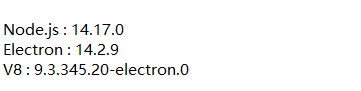

This is still a terrible program, so terrible that I no longer want to crack it. I'll leave this repository to you, and I'll open a new repository to document my research on Electron reverse engineering.
Apologies for the delay in updating; due to some well-known reasons, I had to fight for my country, which delayed my research for quite some time. I will write some related notes in the README, and you can check them out.
Here are some summaries: The new version of YTS uses a technology called bytenode, developed by someone on GitHub. However, this doesn't help much because V8 bytecode is public, and reverse-engineering it is not difficult.
The encryption is standard AES, with no significant reverse-engineering difficulty. The key and IV are extremely easy to obtain. For example, the key and IV in the current version are 7a9B3c5D1e2F4g6H and 2C4d6E8f0A1b3D5e.
I have uploaded the source code directly to the repository, and you can research it yourself. It’s not very meaningful to try to reverse the background and preload parts to the original state.
By the way, the request URL has also changed to https://yts.yuantiaoshi.com:8880.

If there’s an opportunity, I may later write a free software in Rust or Python and upload it.

# This is part of my reverse engineering report on the software

1. The earliest version of YTS didn’t even have backend verification, and the request URL was a plain text IP address. About this, I’ve always been curious. I want to ask the YTS official: Are your servers really that big? This is quite against common sense, and everything that followed confirmed that the software development team’s skill level was like that of a 5-year-old child.
   
2. The map file and JS files were released together, which is the origin of this source code. I’m still a beginner in JS, and I’m not very familiar with many internal principles and implementations of V8 and Node. But I still wrote a script that took me about half an hour and managed to restore most of the code. I spent a lot of time searching for many related libraries on the market, but I couldn’t find a way to combine the map and JS to restore Vue. Otherwise, I could’ve written the script in 10 minutes, or maybe 5 minutes.

3. The AES encryption is essentially useless. I remember someone shared a screenshot with me, where the YTS BOSS said the software had more than 60 "暗桩" I don’t understand what "暗桩" means, but I think it refers to key reverse-engineering points, like puzzles I give my friends. But to me, his reverse-engineering "暗桩" are zero. The later versions might have one. The key and IV are stored in plaintext, and it’s symmetric AES encryption, which is quite laughable.

4. Originally, I should just discuss the software, but I couldn’t help but criticize the YTS boss. He told me the development cost of this software was over RMB 700,000. I thought he was joking, and my Chinese friends didn’t believe it either. In Russia, a 10-year-old child could complete something like this in two weeks, but almost no one does it because creating such software would make you a laughingstock. On Telegram, their developers were relatively friendly, but the things their boss said made me very uncomfortable. Regarding a few other similar Chinese software programs, I also tried to crack them, but they were a hassle. It seemed like there was a Sound based project inside, and it was even an x86 program. At first, I didn’t notice, but after confirming with my friend, it seems to be a uniquely Chinese E-language. There were many Chinese characters inside. Anyway, it was a hassle. It took me about three days to figure it out. The password wheel was very interesting, and I might share it if I have time.

5. By the way, I saw that YTS has a free event. Here, I’ll quote a sentence from that great communist warrior. Although I don’t think Che Guevara ever said this, I still want to use it because it’s true:
   “After we are gone, they will build schools and hospitals for you, and raise your wages. It’s not because they’ve had a change of heart or become good people, but because we were here.”

6. This is purely my personal opinion, but the YTS boss keeps saying he’s not a capitalist. But if he’s not a capitalist, where did his company come from? Where does his revenue come from? He’s still exploiting his employees' surplus value, and he even tried to buy me out. None of this is what a proletarian should do.

# The following are some reverse-engineering details

1. In the beginning, reversing only required opening the dev tool, but clearly, after compiling into V8 bytecode, this method became useless. However, I still managed to implement it. But I actually think debugging with V8’s own `d8` would be much simpler. The first file it starts with is not `background.js`, but `node_modules`. All files are run through V8 in `bytenode`, and we just need to modify the relevant parameters inside. But it’s quite troublesome. Humans are not machines, so it’s impossible to execute every bytecode command completely.

2. Open the app folder with an IDE, and use `d8` as the debugging target, but you need to compile your own V8 engine for this. Also, check the related Node versions. I switched through many versions, but none of them matched. It was really hard to believe YTS used such a low version of Node.  
   

3. The rest is just standard JS reverse engineering. Only Webpack is left, no VMP., so it was quite easy.

4. By the way, there’s an IP in the request header. At first, I thought it was getting the local IP address, but later I discovered it was actually the YTS version number, encrypted with AES. The naming of this parameter is really funny.

5. I don’t understand why they didn’t hire specialized security personnel to write a `jsvmp` or other encryption obfuscation methods. RMB 700,000+ probably won’t be enough to hire `jsvmp`, but there are many reliable encryption methods that could have made it more fun. Instead, they chose to use an open-source project.

# About Usage

You can directly package it into an Electron app and use its API. However, you’ll need to regularly update the key and IV. Or you can reverse-engineer the complete backend. As for `process.exe`, a Chinese friend recently gave me a version, which is actually quite simple. It just modifies some memory values in MediaSDK. But I’m not a fan of software that modifies memory. Actually, you can just kill the `mediaSDK_server.exe` process, and the effect will be the same.
I'm not very familiar with Electron, so the file structure might be incorrect and needs to be adjusted.

# Final Words

This is how capitalists always are. They piece together a trash software from free projects and then profit from it, with none of the earnings going to the open-source authors. But when you threaten their profits, they’ll resort to all kinds of tactics. This is what you call not being a capitalist, YTS BOSS? Ridiculous. You are nothing but a *воровка сука*.
“After we are gone, they will build schools and hospitals for you, and raise your wages. It’s not because they’ve had a change of heart or become good people, but because we were here.”
